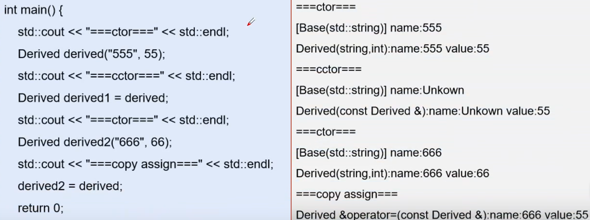

<!--
 * @Author: zzzzztw
 * @Date: 2023-02-27 10:55:11
 * @LastEditors: Do not edit
 * @LastEditTime: 2023-02-27 18:23:58
 * @FilePath: /cpptest/Effectivecpp/clause12.md
-->

# clause.12 赋值对象时，不要忘记每一个成员

例子如下：

```cpp
class Base{
    explicit Base(std::string name= "unkwon"):name_(std::move(name)){
        std::cout<<....<<std::endl;//打印些日志
    }
    Base(const Base& rhs){
        std::cout<<...<<endl;
        name_ = rhs.name_; 
    }
    Base& operator=(const Base& rhs){
        name_ = rhs.name_l
        return *this;
    }
protected:
    string name_;
};

class Derived :public Base{
public:
    friend std::ostream& operator<<(std::ostream& os, const Derived& de);
    Derived(std::string name,int value):Base(std::move(name)),val_(value){};
    Derived(const Dervied& de):val_(de.val_){}
    Derived& operator=(const Derived& de){
        val_ = de.val_;
        return *this;
    }
private:
    int val_;
};
```
子类拷贝构造函数和拷贝赋值运算符实现对象的创造，但以上代码存在问题，结果如下：  
  

可以看出，构造函数时没问题的，但进行derived1 = derived赋值拷贝时，首先调用了基类的构造函数，而不是拷贝构造函数。derived2 = derived时，也没有对name进行赋值。  
所以条款12告诉我们，当我们进行使用类的多态继承时，应确每一个对象都进行赋值，无论是基类还是派生类。  

所以上述做法应该为
```cpp
class Base{
    explicit Base(std::string name= "unkwon"):name_(std::move(name)){
        std::cout<<....<<std::endl;//打印些日志
    }
    Base(const Base& rhs){
        std::cout<<...<<endl;
        name_ = rhs.name_; 
    }
    Base& operator=(const Base& rhs){
        name_ = rhs.name_l
        return *this;
    }
protected:
    string name_;
};

class Derived :public Base{
public:
    friend std::ostream& operator<<(std::ostream& os, const Derived& de);
    Derived(std::string name,int value):Base(std::move(name)),val_(value){};
    Derived(const Dervied& de):Base(de),val_(de.val_){}
    Derived& operator=(const Derived& de){
        Base::operator=(de);
        val_ = de.val_;
        return *this;
    }
private:
    int val_;
};

```

