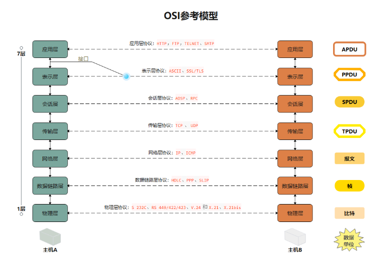

<!--
 * @Author: zzzzztw
 * @Date: 2023-05-15 19:22:36
 * @LastEditors: Do not edit
 * @LastEditTime: 2023-05-19 16:09:57
 * @FilePath: /myLearning/linux网络编程/1TCPIP四层模型与osi七层模型.md
-->
# 1. TCP/IP四层模型和OSI七层模型

### OSI七层模型：

- 应用层：与用户交互的接口层
- 表示层：用户信息和网络格式信息在这一层进行转换
- 会话层：建立和管理应用程序实现自动收发包的功能层
- 传输层：TCP/UDP协议层，监控数据传输服务的质量，保证报文的正确传输。
- 网络层：IP层，根据IP协议进行寻址，从而发送网络包
- 数据链路层：根据ARP协议获得mac头部加在Ip头部上，作用是在以太网之间（电脑上的以太网接口，wifi接口，交换机等）进行通讯，需要用到mac地址
- 物理层：光纤等硬件中的2进制信息。
  
#### 其中OSI七层模型中的应用层，表示层，会话层对应着TCP/IP四层模型中的应用层，传输层和网络层对应传输层和网络层，数据链路层和物理层对应着网络接口层。

### TCP/IP四层模型：

